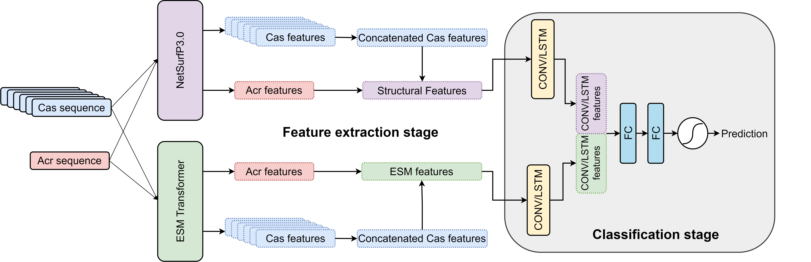

# AcrTransAct Repository 🧬

Welcome to the AcrTransAct repository! 🌟 This repository houses the code and data associated with our paper titled: **"AcrTransAct: Pre-trained Protein Transformer Models for the Detection of Type I Anti-CRISPR Activities"**. The repository not only provides the means to replicate our experiments but also offers insight into the inner workings of our powerful tool. Explore and validate our findings through this repository, and don't forget to check out our interactive **web application** at [AcrTransAct.usask.ca](https://AcrTransAct.usask.ca). 👩‍💻👨‍💻

## Table of Contents 📚

1. [Overview](#overview)
2. [Requirements](#requirements)
3. [Installation](#installation)
4. [Usage](#usage)
5. [License](#license)
6. [Acknowledgements](#acknowledgements)
7. [Contact](#contact)
8. [Cite our Work](#cite-our-work)

## Overview 🌐

AcrTransAct is an advanced web application powered by a transformer-based Deep Neural Network (DNN) designed to predict the likelihood of Acr-mediated CRISPR-Cas inhibition. This sophisticated tool takes protein sequences as input, extracts structural and latent sequence features, and provides insightful predictions about the inhibitory potential of the input protein on various CRISPR-Cas systems.

<p align="center">
  
</p>

## Requirements 🛠️

To dive into the world of AcrTransAct, ensure you have the following requirements:

- Python 3.9
- Bio==1.5.9
- biolib==0.1.9
- biopython==1.80
- ipython==8.3.0
- matplotlib==3.5.2
- numpy==1.21.5
- pandas==1.4.2
- pytorch_lightning==1.8.5.post0
- scikit_learn==1.2.2
- seaborn==0.11.2
- torch==1.12.0
- transformers==4.24.0
- wandb

## Installation ⚙️

1. Clone this repository to your local machine:

```bash
git clone https://github.com/USask-BINFO/AcrTransAct.git
cd AcrTransAct
```

2. Install the required dependencies:

```bash
pip install -r requirements.txt
```

3. Reproduce all the experiments:

```bash
bash code/scripts/training.bash
```

## Usage 🚀

Utilize this repository to replicate our experiments and explore the functionalities of AcrTransAct. The codebase is organized to help you easily navigate through different components and reproduce our results.

## License 📜

This project is licensed under the [MIT License](LICENSE).

## Acknowledgements 🙌

We extend our heartfelt thanks to all the contributors and researchers who have been instrumental in the development of AcrTransAct.

## Contact 📬

For any questions or inquiries, please feel free to open an issue on our repository or contact us at [moein.hasani@usask.ca](mailto:moein.hasani@usask.ca).

## Cite our Work 📖

If you find our work useful, please consider citing it:

```bibtex
@inproceedings{hasani2023acrtransact,
    author = {Moein Hasani and Chantel N. Trost and Nolen Timmerman and Lingling Jin},
    title = {AcrTransAct: Pre-trained Protein Transformer Models for the Detection of Type I Anti-CRISPR Activities},
    booktitle = {Proceedings of The 14th ACM Conference on Bioinformatics, Computational Biology, and Health Informatics (ACM-BCB)},
    year = {2023},
    publisher = {ACM},
    address = {Houston, TX, USA},
    pages = {6},
}
```

Enjoy your exploration of AcrTransAct! 🧬🔍
